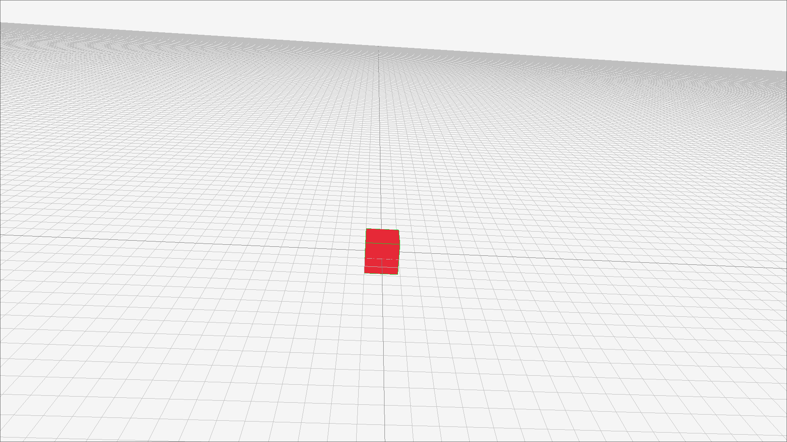

# RAYENGINE << STILL IN DEVELOPMENT >>
New Rayengine built in rust instead.. still the same inside though
Rayengine is targeted to be just another 3D game engine.. using raylib is cheating though..

## HOW TO BUILD 
- `gitclone https://github.com/Sum1Code/rayengine.git`
- `cd rayengine`
- `cargo build`

## Screenshot

